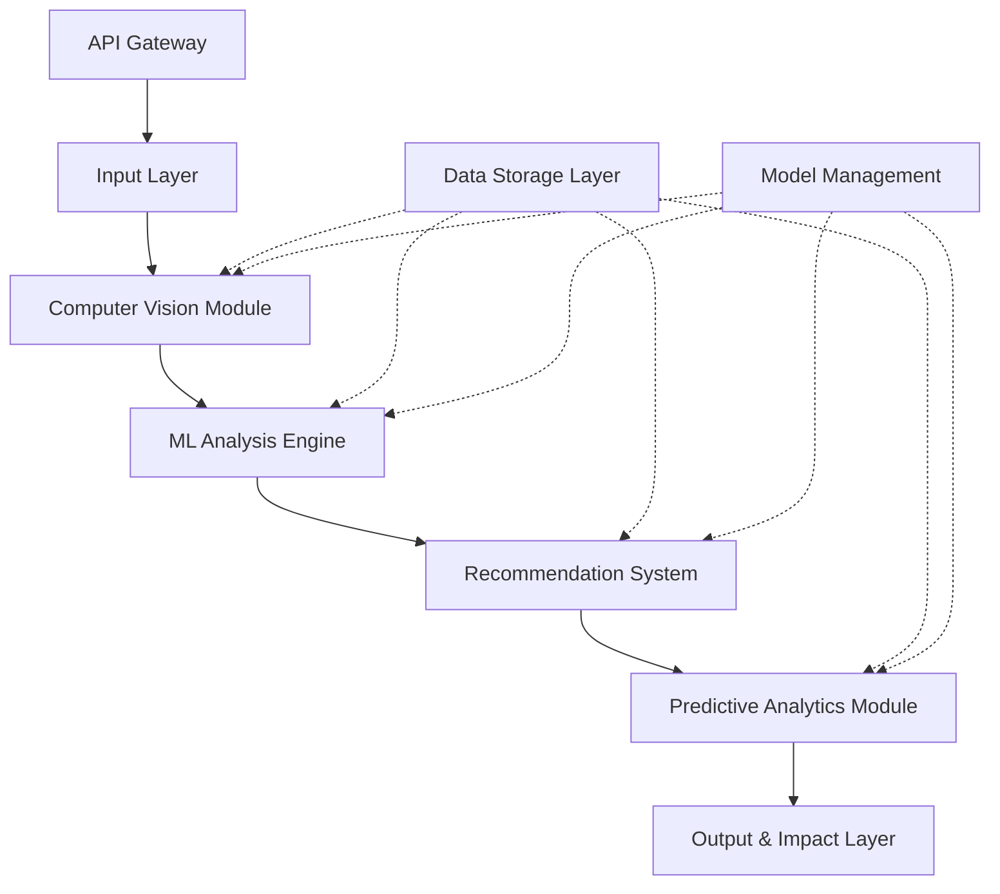

# Design Document: Agro-Waste to Fragrance AI System

## Overview

The Agro-Waste to Fragrance AI system is a comprehensive platform that transforms agricultural waste analysis into actionable fragrance production recommendations. The system employs a six-layer architecture combining computer vision, machine learning, and predictive analytics to provide farmers and cooperatives with economic and environmental insights.

The platform processes agro-waste images through a sophisticated pipeline: image preprocessing, computer vision analysis for waste classification and feature extraction, ML-based fragrance potential scoring, hybrid recommendation generation, predictive analytics for economic and environmental impact assessment, and comprehensive result presentation.

## Architecture

The system follows a layered architecture pattern with clear separation of concerns:



**Layer Responsibilities:**

1. **Input Layer**: Image validation, preprocessing, and data normalization
2. **Computer Vision Module**: CNN/Vision Transformer-based waste classification and feature extraction
3. **ML Analysis Engine**: Fragrance potential scoring and quality grading using supervised learning
4. **Recommendation System**: Hybrid rule-based and ML approach for fragrance product mapping
5. **Predictive Analytics Module**: Economic and environmental impact prediction using regression models
6. **Output & Impact Layer**: Result aggregation, visualization, and report generation

**Cross-cutting Concerns:**
- **Data Storage Layer**: Persistent storage for images, models, and analysis results
- **API Gateway**: RESTful interface for external integrations
- **Model Management**: ML model versioning, training, and deployment pipeline

## Components and Interfaces

### Input Layer Components

**ImageProcessor**
- Validates image formats (JPEG, PNG, TIFF)
- Resizes images to standard dimensions (224x224 for CNN compatibility)
- Normalizes pixel values to [0,1] range
- Applies data augmentation when enabled

**DataValidator**
- Validates image quality and resolution
- Checks file size constraints
- Ensures metadata completeness

### Computer Vision Module Components

**WasteClassifier**
- Implements CNN or Vision Transformer architecture
- Classifies waste into predefined categories (fruit peels, grain husks, flower waste, etc.)
- Returns classification with confidence scores

**FeatureExtractor**
- Extracts texture features using Local Binary Patterns and Gabor filters
- Analyzes color histograms and dominant color extraction
- Generates high-dimensional feature vectors for ML analysis

### ML Analysis Engine Components

**FragrancePotentialPredictor**
- Uses Random Forest or Gradient Boosting models
- Predicts fragrance potential scores (0-100)
- Trained on historical fragrance production datasets

**QualityGrader**
- Maps fragrance potential scores to quality grades (A: 80-100, B: 60-79, C: 40-59, D: 0-39)
- Provides confidence intervals for predictions

### Recommendation System Components

**ProductMapper**
- Rule-based mapping of waste types to fragrance products
- Essential oil recommendations for high-oil content waste
- Incense recommendations for fibrous materials
- Aromatic extract suggestions for flower-based waste

**EconomicRanker**
- Ranks recommendations by economic viability
- Considers processing costs and market prices
- Incorporates seasonal demand variations

### Predictive Analytics Module Components

**EconomicPredictor**
- Regression models for income estimation per kilogram
- Incorporates current market prices and processing costs
- Provides confidence intervals and seasonal adjustments

**EnvironmentalImpactCalculator**
- Calculates CO₂ emissions avoided by preventing waste burning
- Estimates carbon sequestration benefits from fragrance production
- Compares against baseline disposal methods

### Output & Impact Layer Components

**ResultAggregator**
- Combines results from all analysis modules
- Prioritizes recommendations based on multiple criteria

**ReportGenerator**
- Creates comprehensive PDF reports
- Generates visualizations and charts
- Formats data for different user types

## Data Models

### Core Data Structures

**WasteImage**
```
{
  id: string
  userId: string
  imageData: binary
  metadata: {
    uploadTimestamp: datetime
    location: coordinates
    wasteType: string (optional)
    quantity: number (optional)
  }
  processingStatus: enum [uploaded, processing, completed, failed]
}
```

**AnalysisResult**
```
{
  imageId: string
  classification: {
    wasteCategory: string
    confidence: number
    alternativeCategories: array[{category: string, confidence: number}]
  }
  featureVector: array[number]
  fragrancePotential: {
    score: number
    grade: enum [A, B, C, D]
    confidenceInterval: {lower: number, upper: number}
  }
  timestamp: datetime
}
```

**FragranceRecommendation**
```
{
  analysisId: string
  recommendations: array[{
    productType: enum [essential_oil, incense, aromatic_extract]
    suitabilityScore: number
    processingMethod: string
    estimatedYield: number
    economicViability: number
  }]
  rankedByPriority: boolean
}
```

**EconomicProjection**
```
{
  analysisId: string
  incomeEstimate: {
    perKilogram: number
    confidenceInterval: {lower: number, upper: number}
    seasonalAdjustment: number
  }
  processingCosts: {
    equipment: number
    labor: number
    utilities: number
  }
  netProfit: number
  marketFactors: {
    currentPrices: object
    demandTrends: array[number]
  }
}
```

**EnvironmentalImpact**
```
{
  analysisId: string
  co2EmissionsAvoided: {
    fromBurningPrevention: number
    fromFragranceProduction: number
    total: number
    unit: string
  }
  carbonSequestration: number
  sustainabilityMetrics: {
    wasteReductionPercentage: number
    energySavings: number
    waterUsageReduction: number
  }
  carbonCreditEstimate: number
}
```

### Database Schema

**Users Table**
- id (primary key)
- email, name, userType
- apiKey (for programmatic access)
- createdAt, lastLogin

**Images Table**
- id (primary key)
- userId (foreign key)
- filePath, originalName
- metadata (JSON)
- uploadedAt, processedAt

**Analyses Table**
- id (primary key)
- imageId (foreign key)
- results (JSON containing all analysis data)
- processingTime, createdAt

**Models Table**
- id (primary key)
- modelType, version
- filePath, performance metrics
- isActive, deployedAt

## Correctness Properties

*A property is a characteristic or behavior that should hold true across all valid executions of a system—essentially, a formal statement about what the system should do. Properties serve as the bridge between human-readable specifications and machine-verifiable correctness guarantees.*

### Property 1: Image Processing Consistency
*For any* uploaded image file, if it has a valid format (JPEG, PNG, TIFF), then the preprocessing pipeline should produce an output with standard dimensions, normalized pixel values in [0,1] range, and appropriate augmentation when enabled.
**Validates: Requirements 1.1, 1.2, 1.3, 1.5**

### Property 2: Image Quality Validation
*For any* image with insufficient quality metrics (resolution, clarity, file corruption), the system should reject the image and return a descriptive error message explaining the quality issue.
**Validates: Requirements 1.4**

### Property 3: Computer Vision Classification Completeness
*For any* processed image, the computer vision module should produce a classification result containing a valid waste category from the predefined set, confidence score, and properly dimensioned feature vectors.
**Validates: Requirements 2.1, 2.2, 2.3**

### Property 4: Confidence-Based Uncertainty Flagging
*For any* classification result with confidence score below 70%, the system should automatically flag the result as uncertain and include this flag in the output.
**Validates: Requirements 2.4**

### Property 5: Fragrance Potential Score Bounds
*For any* feature vector input to the ML analysis engine, the predicted fragrance potential score should always fall within the valid range of 0-100, and be accompanied by a properly mapped quality grade (A: 80-100, B: 60-79, C: 40-59, D: 0-39).
**Validates: Requirements 3.1, 3.2**

### Property 6: Grade-Based Processing Recommendations
*For any* analysis result with quality grade A (score 80-100), the system should recommend immediate processing, while grade D results (score 0-40) should recommend alternative uses.
**Validates: Requirements 3.3, 3.4**

### Property 7: Prediction Confidence Intervals
*For any* ML prediction (fragrance potential, economic estimates), the system should provide confidence intervals with the specified confidence level (95% for economic estimates).
**Validates: Requirements 3.5, 5.4**

### Property 8: Waste-to-Product Mapping Completeness
*For any* combination of waste classification and fragrance potential score, the recommendation system should produce a complete mapping to suitable fragrance products with appropriate processing methods and economic viability rankings.
**Validates: Requirements 4.1, 4.5**

### Property 9: Conditional Process Recommendations
*For any* waste analysis indicating high essential oil potential, aromatic compounds, or incense suitability, the system should provide appropriate process recommendations (distillation, extraction, or grinding/binding respectively).
**Validates: Requirements 4.2, 4.3, 4.4**

### Property 10: Economic Analysis Completeness
*For any* completed waste analysis, the predictive analytics module should generate income estimates per kilogram, incorporate available market data, calculate net profit when processing costs are known, and apply seasonal adjustments when variations exist.
**Validates: Requirements 5.1, 5.2, 5.3, 5.5**

### Property 11: Environmental Impact Calculation Completeness
*For any* waste processing scenario, the system should calculate CO₂ emissions avoided from burning prevention, estimate carbon sequestration benefits, provide metrics in standard units, compare against baseline disposal methods, and generate carbon credit estimates when requested.
**Validates: Requirements 6.1, 6.2, 6.3, 6.4, 6.5**

### Property 12: Result Presentation Completeness
*For any* completed analysis, the output layer should present classification results with confidence scores, recommendations ranked by priority, economic projections with visual charts when available, environmental metrics display, and provide PDF report generation capability.
**Validates: Requirements 7.1, 7.2, 7.3, 7.4, 7.5**

### Property 13: Data Security and Persistence
*For any* data operation (image upload, result storage, user data handling), the system should ensure secure storage with user consent, persist analysis results for future reference, encrypt sensitive information, apply retention policies with automatic purging, and maintain comprehensive audit logs.
**Validates: Requirements 8.1, 8.2, 8.3, 8.4, 8.5**

### Property 14: Model Lifecycle Management
*For any* model management operation, the system should handle automatic retraining when new data is available or performance degrades, validate model performance against test datasets, maintain version history for rollback capabilities, and support A/B testing for model comparison.
**Validates: Requirements 9.1, 9.2, 9.3, 9.4, 9.5**

### Property 15: API Compliance and Security
*For any* API interaction, the system should provide RESTful endpoints following standard conventions, authenticate requests using API keys, return responses in valid JSON format, implement rate limiting to prevent abuse, and provide comprehensive OpenAPI documentation.
**Validates: Requirements 10.1, 10.2, 10.3, 10.4, 10.5**

## Error Handling

The system implements comprehensive error handling across all layers:

**Input Layer Error Handling:**
- Invalid image formats return HTTP 400 with specific format requirements
- Oversized files return HTTP 413 with size limit information
- Corrupted images return HTTP 422 with quality assessment details
- Missing metadata returns HTTP 400 with required field specifications

**Computer Vision Module Error Handling:**
- Model inference failures trigger fallback to simpler classification models
- Feature extraction errors return partial results with confidence penalties
- GPU memory issues automatically switch to CPU processing with performance warnings
- Classification confidence below threshold triggers human review workflows

**ML Analysis Engine Error Handling:**
- Missing training data triggers model retraining workflows
- Prediction outliers are flagged and require manual validation
- Model performance degradation triggers automatic rollback to previous versions
- Feature vector dimension mismatches return detailed error diagnostics

**Recommendation System Error Handling:**
- Missing market data triggers fallback to historical averages with uncertainty flags
- Invalid waste-product mappings return alternative recommendations with explanations
- Economic calculation errors provide partial results with identified missing components
- Ranking failures return unranked recommendations with warning messages

**Data Layer Error Handling:**
- Database connection failures trigger automatic retry with exponential backoff
- Storage quota exceeded returns HTTP 507 with cleanup recommendations
- Encryption failures prevent data storage and return security error messages
- Audit log failures trigger system alerts and temporary operation suspension

**API Error Handling:**
- Authentication failures return HTTP 401 with clear authentication requirements
- Rate limit exceeded returns HTTP 429 with retry-after headers
- Malformed requests return HTTP 400 with detailed validation error messages
- Internal server errors return HTTP 500 with correlation IDs for debugging

## Testing Strategy

The system employs a comprehensive dual testing approach combining unit tests and property-based tests to ensure correctness and reliability.

**Property-Based Testing Configuration:**
- Minimum 100 iterations per property test to ensure statistical significance
- Each property test references its corresponding design document property
- Tag format: **Feature: agro-waste-fragrance-ai, Property {number}: {property_text}**
- Property tests focus on universal behaviors across all valid inputs
- Random input generation covers edge cases and boundary conditions

**Unit Testing Focus Areas:**
- Specific examples demonstrating correct behavior for known inputs
- Integration points between system components
- Edge cases and error conditions not covered by property tests
- Performance benchmarks for critical operations
- Mock external dependencies (market data APIs, cloud storage)

**Testing Framework Selection:**
- **Python**: Hypothesis for property-based testing, pytest for unit tests
- **TypeScript/JavaScript**: fast-check for property-based testing, Jest for unit tests
- **Java**: jqwik for property-based testing, JUnit 5 for unit tests

**Test Data Management:**
- Synthetic image generation for computer vision testing
- Historical fragrance production data for ML model validation
- Mock market data APIs for economic prediction testing
- Anonymized real-world waste images for integration testing

**Continuous Testing Pipeline:**
- Property tests run on every commit with full 100-iteration cycles
- Unit tests execute in parallel for faster feedback
- Integration tests run on staging environment with real data subsets
- Performance tests execute nightly with trend analysis
- Model accuracy tests run weekly against held-out validation datasets

**Test Coverage Requirements:**
- Minimum 90% code coverage for core business logic
- 100% coverage for data validation and security functions
- Property test coverage for all correctness properties
- Integration test coverage for all API endpoints
- End-to-end test coverage for critical user workflows